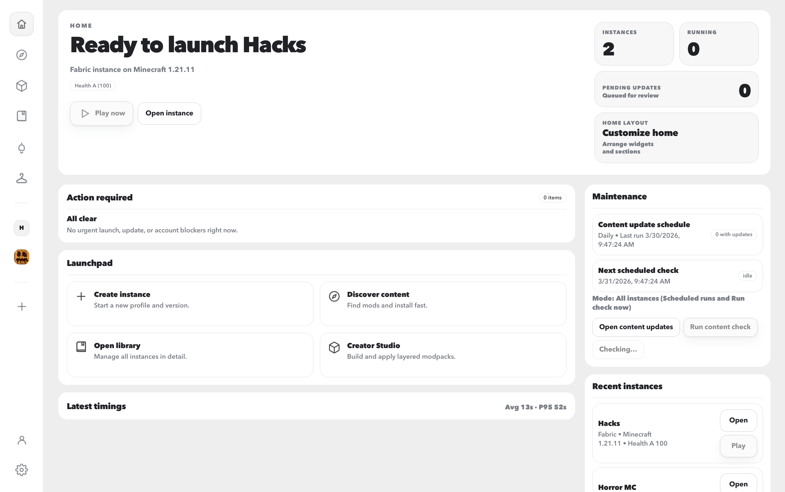
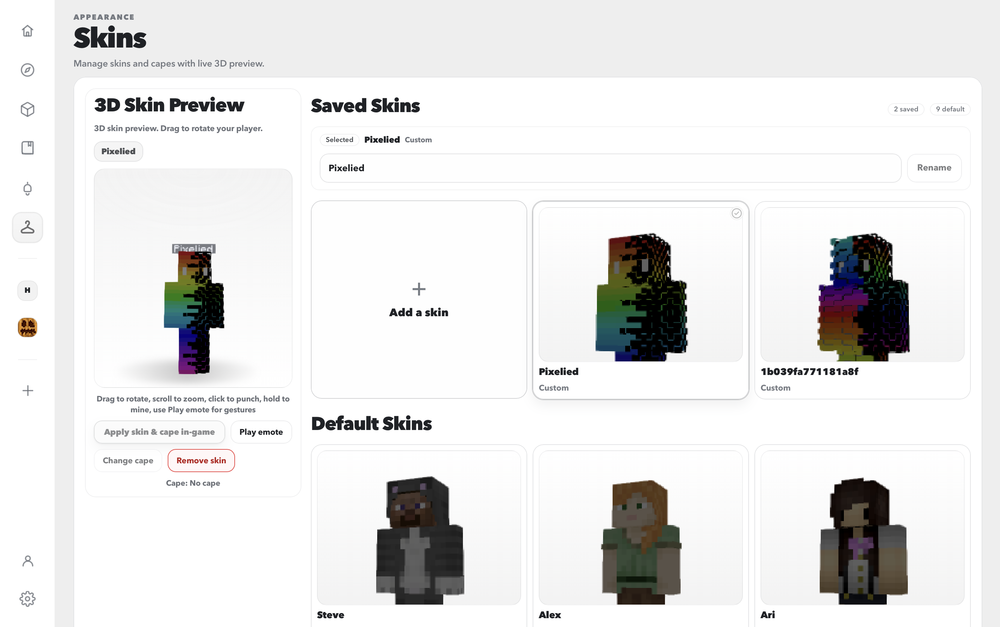

# OpenJar Launcher
**OpenJar Launcher** is a **macOS-first Minecraft launcher and modding toolkit** built with **Tauri (Rust)** + **React (Vite + TypeScript)**.
It is built around the parts of modded Minecraft that usually go wrong: instance sprawl, unknown jars, risky updates, bad installs, broken configs, and pack mismatch between friends.
OpenJar is intentionally **local-first**. Your instances, worlds, configs, lockfiles, snapshots, and backups stay on your machine. Network activity is only used for things you explicitly do, like browsing providers, downloading content, signing in to Microsoft, checking app updates, or syncing with trusted peers.
Security notes live in [`SECURITY.md`](SECURITY.md). License terms live in [`LICENSE.md`](LICENSE.md).
---

## Table of contents
- [Screenshots](#screenshots)
- [Why OpenJar stands out](#why-openjar-stands-out)
- [Features](#features) - [Instances + settings sync](#instances--settings-sync) - [Discover + install](#discover--install) - [Tracked content management](#tracked-content-management) - [Updates + safer maintenance](#updates--safer-maintenance) - [Launching + Quick Play](#launching--quick-play) - [Health, timeline, and playtime](#health-timeline-and-playtime) - [Logs, run reports, and Fix My Instance](#logs-run-reports-and-fix-my-instance) - [Config Editor](#config-editor) - [Creator Studio / Modpack Maker](#creator-studio--modpack-maker) - [Friend Link](#friend-link) - [Snapshots, world backups, and rollback](#snapshots-world-backups-and-rollback) - [Storage Manager](#storage-manager) - [Skins, capes, and account tools](#skins-capes-and-account-tools) - [Settings, personalization, and language support](#settings-personalization-and-language-support) - [Import + export](#import--export)
- [Where your data lives](#where-your-data-lives)
- [Platform support](#platform-support)
- [Dev setup](#dev-setup)
---

## Screenshots
Screenshots live in `readme-assets/images/`. Click any image to view full size.
<p align="center">
<a href="readme-assets/images/home.png">  </a> <a href="readme-assets/images/instance library.png">  </a>
</p>
<p align="center">
<a href="readme-assets/images/discover content.png">  </a> <a href="readme-assets/images/instance content.png">  </a>
</p>
<p align="center">
<a href="readme-assets/images/modpack maker.png">  </a> <a href="readme-assets/images/config editor.png">  </a>
</p>
<p align="center">
<a href="readme-assets/images/updates available.png">  </a> <a href="readme-assets/images/skins.png">  </a>
</p>
---

## Why OpenJar stands out
- **Lockfile-backed installs** so content stays explainable instead of becoming a random pile of jars.
- **Multi-provider discovery / install / update** across **Modrinth**, **CurseForge**, and **GitHub**.
- **Tracked maintenance with pinning** so you can update broadly or keep known-good versions locked.
- **Creator Studio** for layered pack building with preview-before-apply behavior.
- **Config Editor** for real instance/world files with automatic backups.
- **Fix My Instance** with logs, run reports, likely causes, and reversible recovery actions.
- **Snapshots + world backups** so bad installs and bad world moments are both recoverable.
- **Friend Link** for trusted small-group pack parity without a hosted relay.
- **Storage Manager** for reclaimable space, stale runtime cleanup, snapshot pruning, and backup pruning.
- **Skins, capes, and account tools** built into the launcher instead of buried in menus.
OpenJar is not trying to be only a button that launches Minecraft. It is trying to make modded Minecraft more understandable, more recoverable, and less fragile.
---

## Features

### Instances + settings sync
OpenJar centers everything around **self-contained Minecraft instances**. Each instance is a normal folder on disk with its own:
- mods
- resourcepacks
- shaderpacks
- configs
- worlds
- launch settings
- metadata
That means your packs stay understandable outside the app too. They are not hidden inside an opaque internal blob.
Core instance workflow:
- create, rename, or delete instances
- set a custom icon
- open the folder directly in Finder / Explorer
- manage content, worlds, launch state, and diagnostics from the instance page
Per-instance launch controls include:
- Java executable override
- memory limit
- extra JVM args
- keep-launcher-open / close-on-exit behavior
OpenJar also supports **Minecraft settings sync** between instances for the files most people keep redoing:
- `options.txt`
- `optionsof.txt`
- `optionsshaders.txt`
- `servers.dat`
How settings sync works:
- selected settings files are copied before launch
- sync can target all instances or one chosen instance
- file replacement uses atomic behavior for safer writes
- the launcher records attempted / copied / skipped counts
This is for the “same preferences, different pack” workflow. It is separate from Friend Link, which is for keeping different people aligned.
---

### Discover + install
OpenJar can search, inspect, and install content directly into an instance or send it into Creator Studio.
Supported providers:
- **Modrinth**
- **CurseForge**
- **GitHub**
Supported content types:
- mods
- resourcepacks
- shaderpacks
- datapacks
- modpacks
Common filters include:
- loader
- Minecraft version
- content type
- provider/source
- provider-dependent sort options

#### Modrinth
Modrinth has the most complete support path. It supports:
- search and browse
- direct install into an instance
- install preview before apply
- automatic install of required dependencies
- lockfile tracking for later maintenance

#### CurseForge
CurseForge is supported through the same tracked-content model, but provider policy can affect downloadability. It supports:
- search and browse
- install when provider access allows it
- tracked entries in `lock.json`
- refresh and update flows for tracked items
- clear provider-specific error handling
Important reality:
- some CurseForge files block third-party automated download URLs with `HTTP 403`
When that happens, OpenJar does not silently fail. It surfaces the issue and points you toward the fallback:
- open the CurseForge project page
- download it yourself
- use **Add from file**

#### GitHub
GitHub is treated as a first-class provider, but with conservative matching. It supports:
- provider search
- fallback suggestions when other sources are sparse
- install/update from repositories with valid release `.jar` assets
- manual repo attach for locally installed mods
- GitHub-backed metadata in the lockfile when a match is trustworthy
GitHub matching rules are safety-first:
- archived, forked, disabled, or obviously unrelated repositories are filtered out
- loader/version/category matching is best-effort
- local identification prefers strong evidence such as checksum or exact asset filename
- weak matches stay local instead of pretending to be fully tracked
Manual GitHub attach accepts:
- `owner/repo`
- full repository URL
GitHub rate limits are handled through user-provided tokens, secure storage, and token rotation / cooldown behavior. No API keys are embedded in the app.
Discover is also wired into Creator Studio, so search results can be sent straight into the pack you are building.
---

### Tracked content management
The instance content page is where OpenJar turns “what is installed?” into something maintainable.
It tracks:
- mods
- resourcepacks
- shaderpacks
- datapacks
What the content page can do:
- show installed content from `lock.json`
- show provider metadata when available
- enable / disable entries
- delete entries
- bulk select and bulk act on entries
- pin versions
- attach or edit GitHub repo hints
- identify local files against providers
- repair provider metadata when possible
- prune stale rows with **Clean missing entries**
Enable / disable behavior:
- mods use `.jar` ↔ `.jar.disabled`
- packs and datapacks use `<file>` ↔ `<file>.disabled`
A useful detail here is that disabled and broken rows do not just disappear. They stay visible long enough to inspect, repair, or clean up.
`lock.json` stores enough information to make later maintenance explainable:
- provider IDs
- chosen version/file
- filenames
- hashes or fingerprints where available
- enabled state
- metadata needed for refresh, update, rollback, and identification
That means OpenJar remembers where content came from, what version you chose, and how to reason about it later.
---

### Updates + safer maintenance
OpenJar can check for newer compatible versions across:
- Modrinth
- CurseForge
- GitHub
Tracked content types include:
- mods
- resourcepacks
- shaderpacks
- datapacks
What **Refresh / Check** does:
- looks at tracked content in `lock.json`
- checks each entry for a newer compatible provider version/file
- carries forward provider metadata and pinning intent
- surfaces compatibility notes where relevant
- shows current → latest results before anything changes
Pinned entries behave differently:
- pinned entries are skipped by update checks
- pinned entries are skipped by update-all
- unpinning puts them back into normal maintenance flow
Update visibility exists in two places.

#### Per instance
- refresh tracked content
- review available updates
- run **Update all** for that instance

#### Global Updates page
- see which instances have updates
- see how many updates each instance has
- review last checked / next scheduled check
- run manual rechecks
- jump back into the affected instance

#### Scheduled checks
Cadence options:
- Disabled
- Every hour
- Every 3 hours
- Every 6 hours
- Every 12 hours
- Daily
- Weekly
Maintenance styles:
- check only / notify
- auto-apply updates
Auto-apply scope:
- only opt-in instances
- all instances
Auto-apply triggers:
- scheduled runs only
- scheduled runs + manual check-now

#### Safety model
When you use **Update all**, OpenJar creates a **snapshot first**. That snapshot covers installed content and the lockfile, so rollback stays fast if the update goes bad.
Maintenance flows can also surface:
- added / removed / overridden entries
- dependency-aware planning
- compatibility notes
- confidence-style signals
- conflict warnings for things like: - duplicate jars - duplicate mod IDs - wrong-loader mods - missing dependencies
The point is not to make updates feel magical. The point is to make them feel less blind.
---

### Launching + Quick Play
OpenJar supports two main launch styles.

#### Native launch
- Microsoft account sign-in
- native launch orchestration
- running session tracking
- stop running instance
- cancel in-progress launch
- shared cache wiring for assets/libraries/versions

#### Prism launch
- syncs instance content into a Prism instance folder
- uses symlinks when possible
- falls back to copy when needed
- launches through Prism

#### Launch safety
- tracks running launches with per-launch IDs
- blocks unsafe duplicate native launch of the **same instance**
- surfaces launch-stage feedback instead of failing silently
- integrates pre-launch checks where relevant

#### Quick Play
Each instance can store saved server targets so you can jump straight into multiplayer. Quick Play supports:
- saved server name
- host + port
- instance binding
- direct launch-to-server behavior
- later editing or removal
This is for the “this instance always goes to this server” workflow.

#### Voice-chat readiness
OpenJar includes a local pre-launch permission pass for voice-chat-heavy setups. It can:
- detect known microphone-needing mods from enabled tracked content
- show a per-instance permissions checklist
- on macOS native launch, check Java microphone privacy state before launch
- give focused actions such as: - open system settings - launch anyway - re-check
Windows and Linux follow the same general checklist idea, without hard platform assumptions.
---

### Health, timeline, and playtime
Every instance includes a health/status layer so you can spot issues early.
Instance Health includes:
- disk usage
- last launch timestamp
- last known run status
- last exit time
- backup status
OpenJar also tracks **native playtime** based on runtime process activity, with recovery logic for crash/restart scenarios.
The **Timeline** acts as a story of what happened to the instance. It can include:
- installs
- updates
- rollbacks
- config activity
- launch / exit state
- sync-related actions
- recovery actions
Timeline behavior:
- refresh happens automatically in-instance
- clearing the timeline clears both live and persisted entries for that instance
- the goal is a usable history, not a noisy debug dump
This combination makes it easier to answer:
- what changed?
- when did it break?
- what happened just before the crash?
---

### Logs, run reports, and Fix My Instance
OpenJar tries to shorten the distance between “it broke” and “here is the most likely reason.”

#### Logs + crash hints
The launcher can read recent instance logs and analyze them for obvious trouble patterns. It can help surface things like:
- missing dependencies
- loader/version mismatches
- mods named in stack traces
- common warning or error clusters

#### Run reports
Each launch writes a local per-instance run report. Run reports can include:
- launch context
- loader / Minecraft version
- Java and JVM args
- exit kind / exit code
- references to logs when available
- heuristic findings with confidence and short evidence snippets
- likely causes
- recent instance changes
- suggested next actions

#### Fix My Instance
The recovery flow uses those reports to present:
- why the failure likely happened
- what changed recently
- what to try next
- dry-run summaries before reversible actions
Typical safe actions include:
- disabling suspect mods
- snapshot rollback
- jumping to Java settings
- config reset with backup
- opening logs
- exporting a support bundle
It is not trying to replace manual troubleshooting forever. It is trying to make the first recovery pass much faster.
---

### Config Editor
OpenJar includes a real config workflow inside the launcher. This is not just a tiny text box over a file.
Core workflow:
- pick an instance
- optionally pick a world
- browse config files by scope
- edit real files on disk
- reveal them in Finder / Explorer when needed
Supported scope:
- **Instance**
- **World**
Editing tools include:
- text editor
- JSON editor with parsing + friendly errors
- helper views where supported
- advanced mode
- inspector panel with suggestions
- formatting and helper actions
Safety features include:
- automatic timestamped backups before writes
- backup history for the selected file
- restore flow for backed-up versions
The point of Config Editor is simple: let you work on the files that matter, inside the launcher, without pretending the files are not real.
---

### Creator Studio / Modpack Maker
Creator Studio is OpenJar’s built-in pack-building workflow. It is designed for building a real modpack, not just maintaining a loose shopping list.
You can use it to:
- create a pack from scratch
- open an existing pack
- add content directly in the editor
- send content from Discover into the current pack
- choose a target instance
- preview what will happen before apply
- apply in linked or one-time mode
What makes it different from a plain list:
- **layered structure**
- explain-first preview
- linked mode with later re-alignment
- snapshot-backed rollback
Typical layers include:
- **Template**
- **User Additions**
- **Overrides**
That structure helps separate:
- the base pack
- your real additions
- the final conflict fixes or forced winners
Preview/apply flows can surface:
- what will install
- what failed
- what conflicts
- confidence level for the plan
- reasons before mutation
Creator Studio also supports **profiles** such as:
- Lite
- Recommended
- Full
If you want one phrase for Creator Studio, it is this: **pack building with memory and preview, not pack building with hope.**
---

### Friend Link
Friend Link is for the classic modded multiplayer problem: “works on my PC” but nobody else can join.
It links trusted instances between friends so OpenJar can keep everyone aligned before launch.
What can sync:
- lockfile-backed content state
- selected allowlisted config files
Supported config patterns include files like:
- `options.txt`
- `config/**/*.json`
- `config/**/*.toml`
- `config/**/*.properties`
Sync status uses a drift model, not just a vague red warning. It can show:
- `+` added on peer
- `-` removed on peer
- `~` changed between peers
Per-instance sync policy supports:
- Manual
- Ask every time
- Auto-sync metadata only
- Auto-sync everything
Per-content toggles support choices such as:
- mods
- resourcepacks / texture packs
- shaderpacks
- datapacks
Trust guardrails include:
- per-peer trust toggle
- max auto-change threshold before confirmation
- conflict resolution choices such as: - keep mine - take theirs
Behavior highlights:
- metadata-only drift pings can run in the background
- sync prompts can offer review, sync, or snooze actions
- pre-launch sync gate can block stale mismatch states
- offline fallback can still allow launch when local state matches the last known-good snapshot
Current scope:
- designed for small groups
- no hosted cloud relay in v1
- no world save replication in v1
Friend Link is about **pack parity**, not remote file hosting, and not full cloud sync.
---

### Snapshots, world backups, and rollback
OpenJar separates content safety from world safety. That keeps rollback clearer.

#### Snapshots
Snapshots are the undo button for **installed content**. They cover things like:
- `mods/`
- `resourcepacks/`
- `shaderpacks/`
- world `datapacks/`
- `lock.json`
Typical snapshot moments include:
- before install flows
- before update-all
- before pack apply flows
Rollback behavior:
- snapshot history is visible in the UI
- rollback restores tracked content + lockfile state
- Minecraft should be stopped first

#### World backups
World backups protect save data. They:
- zip the full world folder
- store backups per instance
- support retention limits
- support timed automatic backups
Restore behavior:
- choose a backup
- replace the live world with the backed-up version
- stop Minecraft before restoring
This split matters:
- **snapshots** are for content state
- **world backups** are for save state
---

### Storage Manager
Storage Manager is the launcher’s answer to “where did all my disk space go?”
It can scan launcher-managed storage across:
- app data
- shared cache
- instance folders
It helps surface:
- overall totals
- per-instance breakdowns
- reclaimable space
- largest folders
- largest files
- stale runtime/session leftovers
- snapshot usage
- world-backup usage
Cleanup actions can include:
- shared cache cleanup
- stale runtime session cleanup
- snapshot pruning
- world-backup pruning
The flow is meant to be safe and inspectable:
- reclaimable size is shown
- recommended cleanup targets are listed explicitly
- you can drill into paths
- you can reveal selected paths before acting
This becomes especially useful once instances, imports, snapshots, and backups start stacking up.
---

### Skins, capes, and account tools
OpenJar gives appearance/account tools their own dedicated surfaces instead of hiding them behind a tiny submenu.

#### Account
The account page supports:
- Microsoft device-code login
- connected account list
- active account selection
- logout / disconnect
- auth diagnostics
- entitlement status
- profile asset summary
Production builds store refresh tokens in **OS secure storage only**.

#### Skins + capes
The Skins page includes:
- live **3D skin preview**
- drag-to-rotate preview
- saved skins
- default skins
- custom skin import
- rename/remove custom skins
- cape selection / cycling
- apply selected appearance in-game
Behavior notes:
- blocked or missing assets fall back gracefully
- 3D preview can be disabled for lower-end hardware
There are also a few playful touches in the viewer, but the main goal is practical: preview and manage appearance cleanly, inside the launcher.
---

### Settings, personalization, and language support
Settings focuses on the parts of launcher behavior people actually want to tune.

#### Appearance
- theme
- accent choice
- accent strength
- motion profile
- UI density
- reset-to-default appearance flow

#### Language / i18n
- English
- Español
- Français
- Deutsch
- Português (Brasil)
Untranslated areas currently fall back to English.

#### Launch defaults
- default launch method
- Java executable path
- Java detection
- Java 21 shortcut/help for newer versions
- advanced OAuth client ID override

#### App updates
- check for app updates
- auto-check on launch
- release-note excerpt in the UI
- install/restart flow where available

#### Quality-of-life toggles
- auto-identify local files after import
- enable/disable 3D skin preview
- Discord Rich Presence
- Discord Rich Presence detail level
- default support-bundle behavior
- Discover add-tray preferences
- GitHub API token controls
- launch-permission controls
Discord Rich Presence is optional and uses privacy-safe defaults. It does not need to expose server IP, username, world name, or local paths.
---

### Import + export
OpenJar includes several ways to bring content in, move existing setups over, or share pieces back out.

#### Modpack archive import
- Modrinth `.mrpack`
- CurseForge modpack zip files
Current focus:
- read pack metadata such as name, version, and loader
- import override files into the instance

#### Launcher import
- Vanilla Minecraft (`.minecraft`)
- Prism Launcher instances
Common copied data includes:
- `mods/`
- `config/`
- `resourcepacks/`
- `shaderpacks/`
- `saves/`
- `options.txt`
- `servers.dat`

#### Add from file
- mods: `.jar`
- resourcepacks: `.zip`
- datapacks: `.zip`
- shaderpacks: `.zip` or `.jar`
When you import local files, OpenJar can try to identify them back to providers:
- Modrinth by `sha512`
- CurseForge by file fingerprint
- GitHub by release asset filename plus checksum when available
If a match is found, provider metadata is written into `lock.json` so later refresh/update flows still work.
If no match is found, OpenJar keeps it as a local-only tracked entry.

#### Export
OpenJar can export installed mods as a ZIP, including:
- enabled `.jar` files
- disabled `.disabled` files
That is useful for quick sharing, archiving, or preserving only the mods layer of a pack.
---

## Where your data lives
OpenJar stores app data in the OS app-data location used by Tauri. Each instance is still a normal on-disk folder you can open yourself.
A typical instance contains things like:
- `mods/`
- `resourcepacks/`
- `shaderpacks/`
- `config/`
- `saves/`
- `lock.json`
- `snapshots/`
- `world_backups/`
Some users may still have legacy runtime-related directories such as:
- `runtime/`
- `runtime_sessions/`
Current native launches use the canonical instance folder directly.
Privacy note:
- OpenJar does **not** upload your instances, worlds, configs, or saves by default
- network activity is limited to provider, auth, update, and sync flows you explicitly use
---

## Platform support
OpenJar Launcher is **macOS-first**, with cross-platform targets for Linux and Windows.
Current build targets:
- macOS Intel (`x86_64-apple-darwin`)
- macOS Apple Silicon (`aarch64-apple-darwin`)
- Linux x64 (`x86_64-unknown-linux-gnu`)
- Windows x64 (`x86_64-pc-windows-msvc`)
- Windows ARM64 (`aarch64-pc-windows-msvc`)
Notes:
- macOS gets the most day-to-day manual testing
- Linux desktop runtime depends on distro WebKitGTK/libsoup compatibility
- Windows and Linux are supported build targets, but macOS remains the highest-priority platform
If you try Windows or Linux and hit issues, please open a GitHub issue with:
- OS + version
- architecture
- steps to reproduce
- error messages
- relevant logs or screenshots
---

## Dev setup

### Requirements
- Node.js **20+**
- Rust toolchain (**stable**)
- Tauri prerequisites for your OS

### Install
```bash
npm install
```

### Run the frontend
```bash
npm run dev
```

### Run the desktop app
```bash
npm run tauri:dev
```

### Build
```bash
npm run build
npm run tauri:build
```

### Recommended verification
```bash
npm run verify:platform-support
npm run verify:tauri-command-contract
npm run verify:desktop-asset-paths
cargo test --manifest-path src-tauri/Cargo.toml
cargo clippy --manifest-path src-tauri/Cargo.toml --all-targets -- -D warnings
```
For release-specific checks, see [`docs/release-checklist.md`](docs/release-checklist.md).