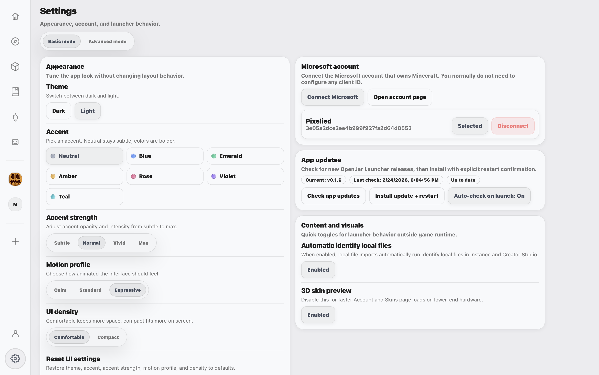

# OpenJar Launcher

**OpenJar Launcher** is a **good-looking, Mac-first Minecraft launcher** built with **Tauri (Rust)** + **React (Vite + TypeScript)**.

It’s designed to feel clean and modern while still being powerful: manage instances, import from other launchers, browse Modrinth/CurseForge/GitHub, install & update content with lockfiles, edit configs with a real UI, and launch safely with explicit guardrails around risky filesystem/runtime behavior.

Security model and hardening notes live in [`SECURITY.md`](SECURITY.md).

---

## Table of contents

- [Screenshots](#screenshots)
- [Highlights](#highlights)
- [Features](#features)
  - [Discover + Install (Multi-provider)](#discover--install-multi-provider)
  - [Updates + Update Availability (Multi-provider)](#updates--update-availability-multi-provider)
  - [Update Preview + Risk](#update-preview--risk)
  - [Instance Health (Per instance)](#instance-health-per-instance)
  - [Installed Content (Per instance)](#installed-content-per-instance)
  - [Logs + Crash Hints](#logs--crash-hints)
  - [Run Reports + Fix My Instance](#run-reports--fix-my-instance)
  - [Permission-Aware Launching (Voice Chat)](#permission-aware-launching-voice-chat)
  - [Config Editor (UI-first, powerful)](#config-editor-ui-first-powerful)
  - [Modpack Maker (Spec / Resolve / Apply)](#modpack-maker-spec--resolve--apply)
  - [Friend Link (Peer Sync for Shared Packs)](#friend-link-peer-sync-for-shared-packs)
  - [Friend Link Dry-Run](#friend-link-dry-run)
  - [World Backups + World Rollback (your saves)](#world-backups--world-rollback-your-saves)
  - [Snapshots + Rollback (installed content)](#snapshots--rollback-installed-content)
  - [Multi-Launch Explained (Isolated Runtime Sessions)](#multi-launch-explained-isolated-runtime-sessions)
  - [Microsoft Account / Auth (Native Launch)](#microsoft-account--auth-native-launch)
  - [Instance Management](#instance-management)
  - [Import / Export](#import--export)
  - [Launching](#launching)
- [Where your data lives](#where-your-data-lives)
- [Tech Stack](#tech-stack)
- [Platform support & testing](#platform-support--testing)
- [Release Checklist](docs/release-checklist.md)
- [Dev Setup](#dev-setup)

---

## Screenshots

Screenshots live in `readme-assets/images/` — click any image to view full size.

<p align="center">
  <a href="readme-assets/images/modpack maker.png">
    
  </a>
  <a href="readme-assets/images/instance%20content.png">
    
  </a>
</p>

<p align="center">
  <a href="readme-assets/images/discover%20content.png">
    
  </a>
  <a href="readme-assets/images/config%20editor.png">
    
  </a>
</p>

<p align="center">
  <a href="readme-assets/images/mod%20updates.png">
    
  </a>
  <a href="readme-assets/images/settings.png">
    
  </a>
</p>

---

## Highlights

- **Clean, modern UI** (macOS-friendly look & feel)
- **Instance management** + import from Vanilla / Prism
- **Multi-provider discovery**: Modrinth + CurseForge + GitHub
- **Update availability** + **Update all** + **scheduled checks** across providers/content types
- **Dependency-aware installs** + per-instance **lockfile** tracking
- **Per-content enable/disable/delete** (mods/resourcepacks/shaderpacks/datapacks)
- **Config Editor** experience (file browser + editors + helpers)
- **Snapshots / rollback** tooling (for installed content)
- **Native launching** + Microsoft account login
- **Launch guardrails** around runtime/session behavior, snapshots, backups, and running-state checks

---

## Features

### Discover + Install (Multi-provider)

Find content and install it straight into an instance.

Discover/search supports:
- **Modrinth**
- **CurseForge**
- **GitHub** (direct source filter + fallback suggestions in `All + Mods`)

Filters include:
- Content type: mods / resourcepacks / shaderpacks / datapacks / modpacks
- Loader: Fabric / Forge / Quilt / NeoForge (and Vanilla where relevant)
- Minecraft version
- Sort: downloads / updated / newest / follows (depends on provider)
- In `All + Mods`, results are mixed across providers, ranking still favors Modrinth entries, and GitHub suggestions are injected when primary providers are sparse.

#### Modrinth (works now)

- Install Modrinth projects into an instance with progress events
- Install planning/preview (“here’s what will be installed before we do it”)
- Automatically installs **required dependencies**
- Writes installs to a per-instance lockfile (`lock.json`) so OpenJar can:
  - check for updates later
  - roll back installed content reliably

#### CurseForge

- Installs are supported through the same lockfile/update model as Modrinth.
- In local dev, key diagnostics are available in the hidden Dev section (`MPM_DEV_MODE=1`).
- Release builds are expected to use build-injected key configuration.
- Some CurseForge files block automated third-party download URL access (`HTTP 403`).
  - OpenJar now surfaces this as a clear actionable error.
  - Recovery path: open the CurseForge project page and use **Add from file** for local import.

#### GitHub

- You can search with source set to **GitHub** only, or use **All** and receive GitHub fallback suggestions.
- Install/update is supported when a repository has a valid release `.jar` asset.
- GitHub mod installs now require explicit compatibility hints for the target instance (loader + Minecraft version) in release metadata/asset naming.
- Safety filters reject archived/fork/disabled repositories and non-mod assets.
- GitHub loader/version/category filters are **best-effort** and based on release asset metadata and repository topics.
- Local import resolver uses strict safety-first evidence for GitHub mapping: checksum/digest and exact asset filename are preferred, and weak/ambiguous matches stay local as non-active candidates.
- If a local mod cannot be auto-matched, you can manually **Attach GitHub repository** from the instance content row (accepts `owner/repo` or full GitHub URL).
- GitHub API rate limits can return `403`; configure tokens in **Settings > Advanced > GitHub API** (secure OS keychain storage) or set `MPM_GITHUB_TOKEN` (or `GITHUB_TOKEN` / `GH_TOKEN`) to raise limits.
- You can also set `MPM_GITHUB_TOKENS` as a comma/semicolon/newline-separated token pool, plus numbered vars like `MPM_GITHUB_TOKEN_1`, `GITHUB_TOKEN_2`, or `GH_TOKEN_3` (up to 200 unique tokens are loaded, hard-capped for predictable memory/perf).
- OpenJar rotates configured tokens in round-robin order, cools down tokens that hit `401`/rate-limit `403`, and then falls back unauthenticated when needed.
- Unauthenticated GitHub requests are short-circuited while cooldown is active after a rate-limit response, so refresh/check continues quickly for other providers.
- OpenJar does not ship embedded GitHub API keys in the app binary/repo; token configuration is user-provided via secure keychain storage and/or environment variables.
- When no token is configured, OpenJar uses a lower GitHub request budget to reduce rate-limit lockouts; adding a token is still strongly recommended for frequent searching.

---

### Updates + Update Availability (Multi-provider)

This feature keeps installed content up to date across **Modrinth + CurseForge + GitHub** and across supported content types tracked in `lock.json` (mods/resourcepacks/shaderpacks/datapacks).

What “Refresh / Check” actually does:
- Looks at tracked content entries currently installed in that instance
- For each entry, checks for a newer compatible provider version/file
- Shows you a clear per-entry result like:
  - `Sodium 0.5.11 → 0.5.13`
  - `Fabric API 0.97.0 → 0.98.1`
- Does not change anything until you choose to apply updates

Where you see updates:

Per instance (Maintenance card):
- **Refresh** checks tracked content in the selected instance
- You get a quick list of updates available (current → latest)
- **Update all** applies updates for tracked entries only

Global Updates page (Update availability dashboard):
- Shows which **instances** have tracked content updates available, and **how many**
- Shows **last checked** and **next scheduled check**
- Lets you jump into an instance (“Open instance”) or run a new check (“Recheck”)
- Adds a sidebar badge when any instance has updates waiting

Scheduled checks (so you don’t have to remember):
- Set a **Check cadence**:
  - Disabled, Every hour, Every 3 hours, Every 6 hours, Every 12 hours, Daily, Weekly
- The Updates page shows:
  - **Last run** (last scheduled/manual check)
  - **Next run** (next scheduled check)
- **Check now** triggers a full tracked-content update check immediately

Update-all safety (so updates don’t feel risky):
- When you hit **Update all**, OpenJar creates a **snapshot first**
- If an updated mod breaks your game, you can roll back your *installed content* with one click
- Snapshots cover installed content (mods/packs/datapacks + lockfile), not full world saves (world saves are handled by World Backups)

Optional auto-apply (choose “notify me” vs “do it for me”):
- Choose what happens when a scheduled check finds updates:
  - **Check only (notify):** OpenJar shows the badge + update list, and you choose when to apply.
  - **Auto-apply updates:** OpenJar checks **and** applies updates automatically based on your policy.
- Choose where auto-apply is allowed:
  - **Only opt-in instances** (instances you’ve explicitly marked as OK to auto-update)
  - **All instances**
- Choose when auto-apply can run:
  - **Scheduled runs only** (recommended)
  - **Scheduled + “Check now”** (manual checks can also auto-update)

In short: OpenJar tells you exactly which tracked entries are outdated, lets you **update all** in one click, can **check on a schedule**, and gives you a snapshot so you can undo if something goes wrong.

---

### Update Preview + Risk

OpenJar adds lightweight “preview before apply” signals so updates feel safer:

- **Preview update modpack from instance** shows added / removed / overridden entries before apply.
- **Conflict suggestions include risk tags** (`low` / `medium`) so you can triage quickly.
- **Confidence + warnings** stay visible through resolve/apply flows instead of being hidden.

---

### Instance Health (Per instance)

Each instance now includes a compact health panel for quick status checks:

- **Disk usage** of the instance folder.
- **Last launch timestamp** (captured when launch starts).
- **Last known run status** (`Successful launch`, `Crashed`, or `Unknown`) and last exit time.
- **Backup status** (latest world backup time + whether auto backups are enabled).

Last-run metadata is stored per instance in app data (`last_run_metadata.v1.json`), not browser local storage.

---

### Installed Content (Per instance)

Keep track of what’s installed, and quickly toggle or remove entries when troubleshooting.

- View installed content list (from `lock.json`) across:
  - mods
  - resourcepacks
  - shaderpacks
  - datapacks
- Enable/disable supported content entries:
  - mods: `SomeMod.jar` ↔ `SomeMod.jar.disabled`
  - resourcepacks/shaderpacks/datapacks: `<file>` ↔ `<file>.disabled`
- Delete supported content entries directly from the instance UI.
- Lockfile tracking (`lock.json` stored inside the instance folder)
  - Stores provider IDs + chosen version + filename + hashes + enabled/disabled state

---

### Logs + Crash Hints

OpenJar can read the latest instance logs and give you faster signals.

- Read instance logs
- Frontend log analyzer:
  - counts errors/warnings
  - tries to identify likely causes (“suspects”) based on common patterns
    (mod mentioned in a stack trace, missing dependency, incompatible loader/version, etc.)

---

### Run Reports + Fix My Instance

Each launch now writes a local per-instance run report (`run_reports.v1.json`) with:

- launch context (MC/loader version, Java, memory/JVM args, exit kind/code, timestamp)
- artifact references (latest launch/crash logs when available)
- local heuristic findings with confidence + short evidence snippets
- top likely causes, recent instance changes, and reversible suggested actions

The **Fix My Instance** flow now uses these reports to show:

- **Why this happened** (top causes + findings)
- **What changed recently** (installs/updates/rollbacks/config/friend-link activity)
- **What to try next** with dry-run summaries before apply

Safe actions include disabling suspect mods, snapshot rollback, Java-settings jump, config reset with backup, opening logs, and support bundle export.

---

### Permission-Aware Launching (Voice Chat)

OpenJar now includes a local pre-launch permission pass for voice chat packs:

- Detects known mic-needing mods from enabled lockfile entries (starting with high-confidence voice chat mod rules).
- Adds a per-instance **Permissions** checklist (microphone now, camera/screen/accessibility placeholders for future expansion).
- On macOS native launch, checks Java microphone privacy state before launch and shows a focused pre-launch prompt when access is missing/denied:
  - **Open System Settings**
  - **Launch anyway**
  - **Re-check**
- Windows/Linux keep the same checklist flow and degrade gracefully without hard launch blocking.

---

### Config Editor (UI-first, powerful)

A full config editing experience inside the app.

Core workflow:
- Instance picker dropdown
- Optional world picker (lists worlds in `saves/`)
- Unified config browser for **Instance** and **World** scopes
- Instance scope edits real files on disk (allowlisted paths only: `config/**`, `options.txt`; packs shown read-only)
- Reveal/open files in your file manager (Finder/Explorer/etc.)

Editing tools:
- Read and save files
- Create new config files (New File modal)
- Automatic timestamped backups before instance file writes
- Backup history + restore for the currently selected instance file
- Specialized editors:
  - JSON editor (parsing + friendly error display)
  - Text editor
  - `servers.dat` helper view when an editable text representation is available
- Advanced editor mode
- Inspector panel (context + suggestions)
- Helper features (formatting + suggestions)

---

### Modpack Maker (Spec / Resolve / Apply)

Creator Studio -> **Creator** is OpenJar’s built-in modpack builder.  
It helps you build a real modpack (not just a random list), preview what will happen for a specific instance, and apply safely with rollback support.

How to use it:
- Create or open a modpack in **Creator Studio -> Creator**
- Add content in the editor (quick add) or click **Open in Discover** for full browsing/filtering
- Choose the target instance and run **Preview + apply** to see exactly what will install
- Review results first: compatible installs, failures, conflicts, and confidence level
- Apply in **Linked** mode (track + re-align later) or **One-time** mode, with snapshot + rollback safety

What makes it unique:
- **Layered packs** so your pack stays organized:
  - `Template` = base pack
  - `User Additions` = your main add/remove list
  - `Overrides` = explicit conflict fixes or final wins
- **Open in Discover workflow** that adds search results straight into the selected modpack layer
- **Unified entries list + inspector** so you can quickly review and edit per-entry settings
- **Explain-first preview** with clear reasons when something fails (no silent changes)
- **Profiles** (like Lite / Recommended / Full) to toggle optional content cleanly
- **Linked mode + drift detection** to keep instances aligned over time
- **Reversible applies** with lock snapshots and one-click rollback

---

### Friend Link (Peer Sync for Shared Packs)

Friend Link is built for the exact “works on my PC” problem when playing modded with friends.

Link your instances once, and OpenJar keeps everyone aligned before launch so your group can actually join the same local hosted world without the usual “missing mod / wrong version” chaos.

In short: this is how you avoid the classic “can’t join your friend’s world” mod mismatch headache.

What syncs:
- Lockfile-backed content state (mods/resourcepacks/shaderpacks/datapacks)
- Allowlisted config files (`options.txt`, `config/**/*.json`, `config/**/*.toml`, `config/**/*.properties`)

Sync UX and status (latest):
- Background drift ping (metadata-only, no file transfer) runs periodically to detect remote changes quickly
- Unsynced badge uses `+ / - / ~` counters:
  - `+` = added on peer
  - `-` = removed on peer
  - `~` = changed between peers
- Sync intent prompt: **Review changes**, **Sync now**, **Snooze 30m**
- Selective sync: choose specific rows/keys to sync (instead of all-or-nothing)
- Per-content sync toggles (per instance):
  - Mods (default on)
  - Resource packs / texture packs (default off)
  - Shader packs (default on)
  - Datapacks (default on)
- Policy modes per instance:
  - `Manual`
  - `Ask every time` (default)
  - `Auto-sync metadata only`
  - `Auto-sync everything`
- Trust guardrails:
  - Per-peer trust toggle
  - Max auto-change threshold before requiring confirmation

Safety behavior:
- Two-way reconcile with conflict detection
- Explicit conflict resolution (`keep mine` / `take theirs`)
- Pre-launch sync gate for linked instances
- Sync reliability improvements:
  - auto-retry on missing local files
  - provider fallback download path when peer file transfer isn’t enough
- Offline fallback:
  launch is allowed only when local state matches last-good group snapshot; stale offline state is blocked with a clear reason

How pairing works:
- Create host link -> share invite code
- Join link with invite code
- Transport uses encrypted and authenticated frames (shared-secret derived keys + AEAD)
- Endpoint policy defaults are safe:
  - private/local addresses allowed by default
  - loopback blocked by default (dev-only opt-in)
  - public internet blocked by default (explicit opt-in required)

Current scope:
- Designed for small groups (max 8 peers)
- No hosted cloud relay service in v1 (direct peer endpoint model)
- No world save replication in v1 (content/config parity only)

### Friend Link Dry-Run

The Friend Link panel includes a dry-run summary before sync:

- **Change count** and `+ / - / ~` drift breakdown.
- **Estimated total bytes** plus unknown-size row count.
- **Top path prefixes** so you can see where most changes are.
- **Clear “what will change” summary** (including untrusted-peer warnings when present).
- **Allowlist presets** for quick scope control:
  - `Mods only`
  - `Mods + Configs`
  - `Everything` (warning shown)

---

### World Backups + World Rollback (your saves)

This is the “I don’t want to lose my world” safety net.

What it does:
- OpenJar can periodically back up each world in `saves/`
- Each backup is a **zip of the entire world folder**
  (region, playerdata, data, advancements, etc.)
- Backups are stored under `world_backups/` inside the instance folder

How you control it (per instance):
- Backup interval (minutes)
  - Example: every 10 minutes OpenJar zips your world and stores a backup
- Retention count (per world)
  - Example: keep the last 3 backups of each world, delete older ones automatically

World rollback (restore a backup):
- Choose a backup (most recent or a specific one)
- Restoring **replaces** `saves/<world>` with the backed-up copy
- You must stop Minecraft before restoring a world

Important nuance:
- OpenJar currently blocks starting a second **native** run of the same instance.
- This is intentional: same-instance concurrent native sessions only copied Minecraft settings back cleanly, so world/config changes could be lost.
- Auto world backups only run for the primary canonical instance launch, not disposable runtime-session clones from older builds.

---

### Snapshots + Rollback (installed content)

Snapshots are your “undo” button for **installed content** — not your entire world.

What a snapshot is:
- A stored copy of specific *content folders* + the lockfile at that moment,
  so you can revert after a bad install/update.

What gets snapshotted:
- `mods/`
- `resourcepacks/`
- `shaderpacks/`
- each world’s `saves/<world>/datapacks/`
- the instance `lock.json`

What does *not* get snapshotted:
- Your world data (region/playerdata/etc.) — that’s handled by **World Backups**
- Other world files outside `datapacks/`
- General config folders (for now)

When snapshots are created:
- Before installing content (when there are real actions to apply)
- Before applying presets (if enabled)
- Before “Update all” (when updates exist)

How rollback works:
- Snapshots are kept (up to 20) and listed in the UI
- Rolling back restores the snapshot’s content folders + the saved `lock.json`
- You must stop Minecraft before rolling back

---

### Multi-Launch Explained (Isolated Runtime Sessions)

OpenJar still contains isolated runtime session machinery, but current releases intentionally block starting a second **native** launch of the same instance.

How it behaves:
- Normal launch: the game runs directly from the canonical instance folder
- Concurrent native same-instance launch: blocked up front with a clear error instead of risking silent data loss
- Shared cache wiring is still used for the active runtime (`assets/libraries/versions`)

Why it exists:
- The old isolated-session flow reduced write collisions, but it did not reconcile full world/config changes back safely enough.
- The current guardrail favors correctness over “it kind of works sometimes.”

---

### Microsoft Account / Auth (Native Launch)

Sign in and stay signed in.

- Microsoft device-code login flow (begin + poll)
- List saved accounts
- Select active account
- Logout/disconnect
- Account diagnostics (helps when auth gets weird)
- Production builds store refresh tokens in OS secure storage only.
- Dev builds (`npm run tauri:dev`) keep a debug-only recovery fallback file to avoid repeated local re-login loops during development.

---

### Instance Management

Create and manage self-contained “instances” (your own Minecraft folders with their own mods, packs, saves, and settings).

What you can do:
- Create, list, rename, edit, delete instances
- Open/reveal instance folders and common paths
- Instance icons (store an icon path + load local images for display)

Per-instance launch settings (these affect the actual launch):
- Java executable path (or auto-detect a runtime)
- Memory limit (adds `-Xmx####M`)
- Extra JVM args
- “Keep launcher open” / “Close on game exit”

Note on settings:
- Some extra toggles exist in the UI/settings model (graphics preset, shader toggle, vsync, prefer releases, etc.)
- If something doesn’t change the game yet, it means it isn’t fully hooked up in the current build.

---

### Import / Export

Move your existing setup into OpenJar and back out again.

Create instance from a modpack archive (“From File” flow):
- Supports **Modrinth `.mrpack`** and **CurseForge** modpack zips
- Reads pack name / Minecraft version / loader from pack metadata
- Imports **override files** (configs/resources/scripts/etc.) into the instance

Important:
- It does **not** automatically download the modpack’s mods yet — it currently extracts overrides only.

Import instances from other launchers:
- **Vanilla Minecraft** (`.minecraft`)
- **Prism Launcher** instances (auto-detected)
- Copies common folders like:
  - `mods/`, `config/`, `resourcepacks/`, `shaderpacks/`, `saves/`
  - plus `options.txt` and `servers.dat`

Other import/export tools:
- Import local files into an instance (“Add from file”)
  - Supported local file types:
    - mods: `.jar`
    - resourcepacks: `.zip`
    - datapacks: `.zip`
    - shaderpacks: `.zip` or `.jar`
  - OpenJar attempts provider detection for local imports (when hashes/fingerprints match):
    - **Modrinth** by file `sha512`
    - **CurseForge** by file fingerprint
    - **GitHub** by release asset filename match (plus checksum validation when available)
  - When matched, the lock entry is saved with provider/source IDs so update checks and update-all work normally.
  - If no provider match is found, it falls back to a local-only lock entry.
- Export installed mods as a **ZIP**
  - Includes enabled `.jar` files and disabled `.disabled` files

---

### Launching

Two launch modes depending on how you prefer to run Minecraft.

Native launch mode (no Prism required):
- Loader support includes Vanilla / Fabric / Forge (auto resolution logic)
- Uses shared caches under app data (assets/libraries/versions caching)

Prism launch mode:
- Syncs instance content into a Prism instance folder
- Uses symlinks when possible, with copy fallback
- Launches through Prism’s workflow

Basic safety controls:
- Tracks running launches (per-launch IDs)
- Stop a running instance
- Cancel an in-progress launch
- Prevents unsafe duplicate native launch of the *same* instance folder

---

## Where your data lives

OpenJar keeps your data **on your computer** in your OS app data directory (Tauri app data). Each instance is just a normal folder structure you can open in your file manager.

Per instance you’ll typically see:

- `mods/`, `resourcepacks/`, `shaderpacks/`, `config/`, `saves/`
- `lock.json` (tracks what OpenJar installed so updates/rollback are reliable)
- `snapshots/` (snapshots of installed content for rollback)
- `world_backups/` (zipped backups of your worlds, based on your backup settings)
- `runtime_sessions/` (temporary isolated launch sessions for concurrent native runs; disposable)
- Optional legacy `runtime/` may still exist from older builds, but regular native launches use the canonical instance folder directly.

Privacy note: OpenJar doesn’t upload your instances, worlds, or configs anywhere — it works directly with the files on your machine. Anything network-related is only for things you explicitly do (like browsing/installing from Modrinth/CurseForge/GitHub or signing in to Microsoft for launching).

---

## Tech Stack

- **Tauri v1** + **Rust** backend
- **React + TypeScript** frontend (**Vite**)
- Multi-provider content flows (**Modrinth + CurseForge + GitHub**)
- Clean separation between UI, commands, and instance filesystem operations

---

## Platform support & testing

OpenJar Launcher is **macOS-first** (highest-priority platform), with cross-platform builds for Linux and Windows.

Current build targets:
- macOS Intel (`x86_64-apple-darwin`)
- macOS Apple Silicon (`aarch64-apple-darwin`)
- Linux x64 (`x86_64-unknown-linux-gnu`)
- Windows x64 (`x86_64-pc-windows-msvc`, intended for Windows 11)
- Windows ARM64 (`aarch64-pc-windows-msvc`, including Windows on ARM)

CI runs a Tauri build matrix for all of the targets above and uploads artifacts per platform.

Contributor check:
- Run `npm run verify:platform-support` before opening a PR if you change platform targets or support docs.
- Run `npm run verify:tauri-command-contract` before opening a PR if you add/rename/remove Tauri commands.
- Run `npm run build`, `cargo test`, and `cargo clippy --all-targets -- -D warnings` before cutting a release.
- CI enforces both checks in `.github/workflows/ci-build.yml`.

Release hardening:
- Use the local release checklist in [`docs/release-checklist.md`](docs/release-checklist.md) before publishing a build.
- The checklist includes smoke tests for launch/runtime behavior, content updates, settings sync, and account/auth recovery.

Known limitations:
- Windows CI runs on GitHub-hosted Windows Server images, not a full Windows 11 desktop session.
- Linux desktop runtime depends on WebKitGTK/libsoup2 packages available on the target distro.
- macOS receives the most day-to-day manual testing.
- Same-instance concurrent native launch is intentionally blocked until full runtime-session reconciliation is implemented for worlds/configs.

If you try Windows/Linux and run into issues, please open a GitHub Issue with:
- OS + version (and whether it’s Intel/AMD or ARM)
- steps to reproduce
- error messages
- relevant logs (and screenshots if helpful)

---

## Dev Setup

### Requirements

- Node.js **18+** recommended
- Rust toolchain (**stable**)
- Tauri prerequisites for your OS

### Install

```bash
npm install
````

### Run (dev)

Frontend only (Vite):

```bash
npm run dev
```

Full desktop app (Tauri + Vite):

```bash
npm run tauri:dev
```

### Build

Frontend build:

```bash
npm run build
```

Tauri desktop build:

```bash
npm run tauri:build
```

On macOS, this build command produces the `.app` bundle and then creates a `.dmg`.

### macOS Spotlight + Launchpad verification

After building a macOS bundle, run:

```bash
./scripts/verify-macos-bundle.sh
```

Or point to a specific app bundle:

```bash
./scripts/verify-macos-bundle.sh "/path/to/OpenJar Launcher.app"
```

The script validates required bundle metadata (`CFBundleIdentifier`, display name, category, version keys) and reports LaunchServices / Spotlight indexing hints.

If Spotlight or Launchpad still does not show the app for a fresh local unsigned build, run:

```bash
/System/Library/Frameworks/CoreServices.framework/Frameworks/LaunchServices.framework/Support/lsregister -f "/path/to/OpenJar Launcher.app"
mdimport "/path/to/OpenJar Launcher.app"
/usr/bin/killall Finder
```

For downloaded builds, also remove quarantine before re-indexing:

```bash
xattr -dr com.apple.quarantine "/path/to/OpenJar Launcher.app"
```

### Preview (frontend build)

```bash
npm run preview
```
